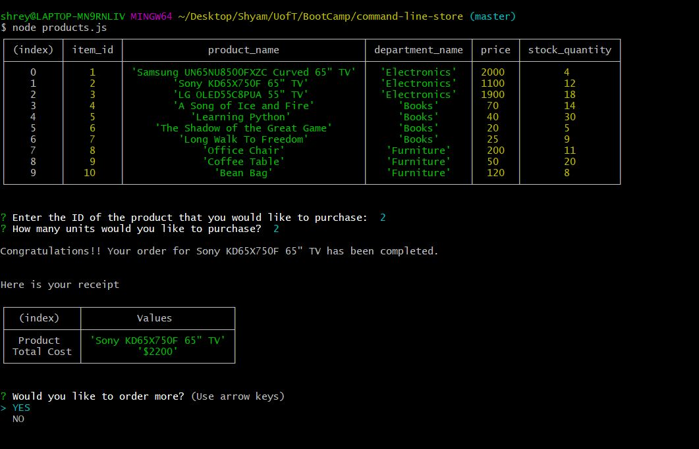

# Command Line Store - A Node JS Application

## Getting Started

These instructions will get you a copy of the application up and running on your local machine for development and testing purposes.

This is a Node JS application that 

- displays a list of available products in the database
- allows you to place an order
- fulfills the order by updating the database

## Application Folder structure

```
.
|-- README.md
|-- images
|   `-- how-to-use.JPG
|-- package-lock.json
|-- package.json
|-- products.js
|-- schema.sql
`-- seed.sql

```
## Prerequisites

* Ensure you have MySQL Server and Workbench installed, if not visit the below links for instructions.  

  - Server - https://dev.mysql.com/downloads/windows/installer/8.0.html 
  - Workbench - https://dev.mysql.com/downloads/workbench  

* Download the repository

* Launch MySQL Workbench and Create the database and table using the schema.sql.

* Use the seed.sql to insert records into the products table.
  
* Initialize node project and install dependencies using Node Package Manager.

```
$ npm init -y
$ npm install
```

## How to run the application

 

